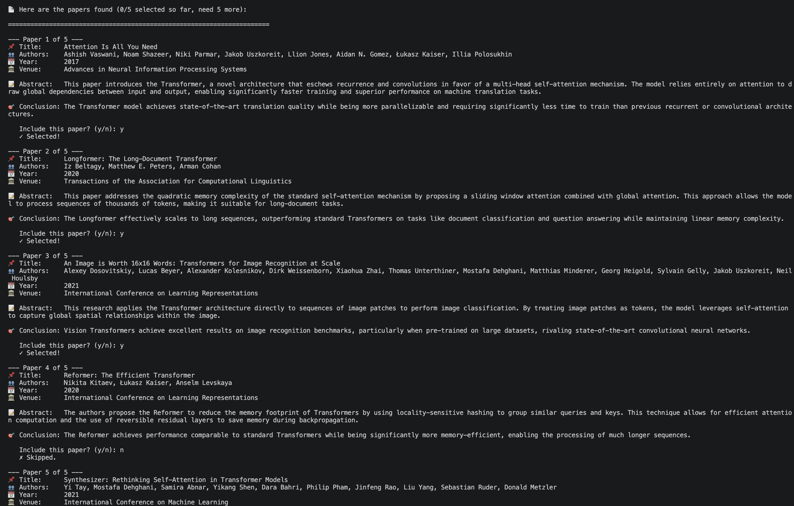
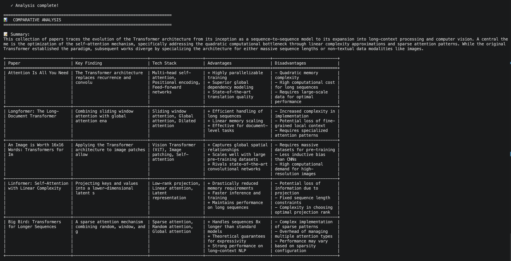

# PaperAnalyzer

An interactive CLI tool that finds, curates, and comparatively analyses academic papers on any research topic — powered by **Google Gemini** and orchestrated with **LangGraph**.

---

## What it does

1. You enter a research topic.
2. The tool searches for 5 relevant papers using Gemini.
3. You review each paper (title, abstract, conclusion) and decide which to keep.
4. If you haven't selected 5 yet, it searches again — excluding papers you've already seen.
5. Once 5 papers are selected, it generates a structured comparative analysis: key findings, tech stacks, advantages, and disadvantages for each paper.




---

## Agents

| Agent | File | Role |
|---|---|---|
| **Search Agent** | `agents/search_agent.py` | Queries Gemini to surface 5 relevant papers per round, avoiding previously seen titles |
| **Analysis Agent** | `agents/analysis_agent.py` | Produces a structured JSON comparison of the 5 selected papers — summary, findings, tech stack, pros/cons |

---

## Graph Nodes (LangGraph)

The pipeline is a `StateGraph` with a built-in loop:

```
search → present → check ──► analyse → END
             ▲          │
             └──────────┘ (if < 5 papers selected)
```

| Node | File | Role |
|---|---|---|
| `search` | `nodes/search_node.py` | Calls the Search Agent; appends results to state |
| `present` | `nodes/present_node.py` | Shows papers to the user; collects accept/reject decisions |
| `check` | `nodes/check_node.py` | Routes to `analyse` if 5 papers selected, else loops back to `search` |
| `analyse` | `nodes/analyse_node.py` | Calls the Analysis Agent; writes the final comparison to state |

---

## Setup

**Prerequisites:** Python 3.10+, a [Google AI Studio](https://aistudio.google.com/) API key.

```bash
# 1. Clone the repo
git clone https://github.com/your-username/PaperAnalyzer.git
cd PaperAnalyzer

# 2. Create and activate a virtual environment
python -m venv venv
source venv/bin/activate   # Windows: venv\Scripts\activate

# 3. Install dependencies
pip install -r requirements.txt

# 4. Add your API key
echo "GEMINI_API_KEY=your_key_here" > .env
```

---

## Run

```bash
python main.py
```

You'll be prompted to enter a research topic, then interactively select papers until 5 are chosen. The final comparative table is printed to the terminal.

---

## Project Structure

```
PaperAnalyzer/
├── main.py           # Entry point — builds graph, runs it, displays results
├── graph.py          # LangGraph StateGraph definition
├── state.py          # Shared state schema (TypedDict)
├── prompts.py        # Prompt templates for both agents
├── agents/
│   ├── search_agent.py
│   └── analysis_agent.py
├── nodes/
│   ├── search_node.py
│   ├── present_node.py
│   ├── check_node.py
│   └── analyse_node.py
├── requirements.txt
└── .env              # Not committed — add your GEMINI_API_KEY here
```

---

## License

MIT — see [LICENSE](LICENSE).
